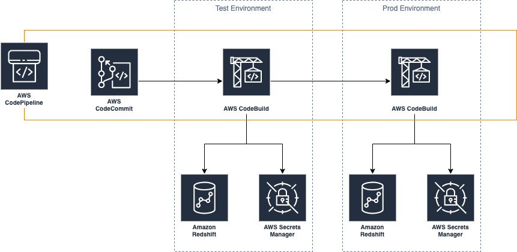

# Redshift Devops

## High Level Architecture

## Components
This demo uses the following components to enable CI/CD of Redshift Stored Procedures and schema changes.
- AWS CodePipeline to do the overall orchestration.
- AWS CodeCommit as the version control system. 
- AWS CodeBuild as the execution environment for Apache Maven.
- AWS Secrets Manager to store the Redshift connection parameters.

The application uses Apache Maven with Flyway for database migrations and JUnit for unit testing.

The demo also provides 2 types of buildspec file:
- buildspec_test.yml for the testing phase
- buildspec_prod.yml for the deployment phase

## CloudFormation Template
You can deploy the demo pipeline using the provided CloudFormation template. Deployment instructions are as follows:

- Provision 2 Redshift clusters, one for test and another one for prod.
- Clone the repository.
- Deploy the template using CloudFormation.
    - This will deploy services similar to the diagram above.
- Push the code to the newly created CodeCommit repository.
- This will then trigger the rest of the pipeline.
- You can go to the CodeBuild console to view the test result (there's only one, but you can see how the integration works).